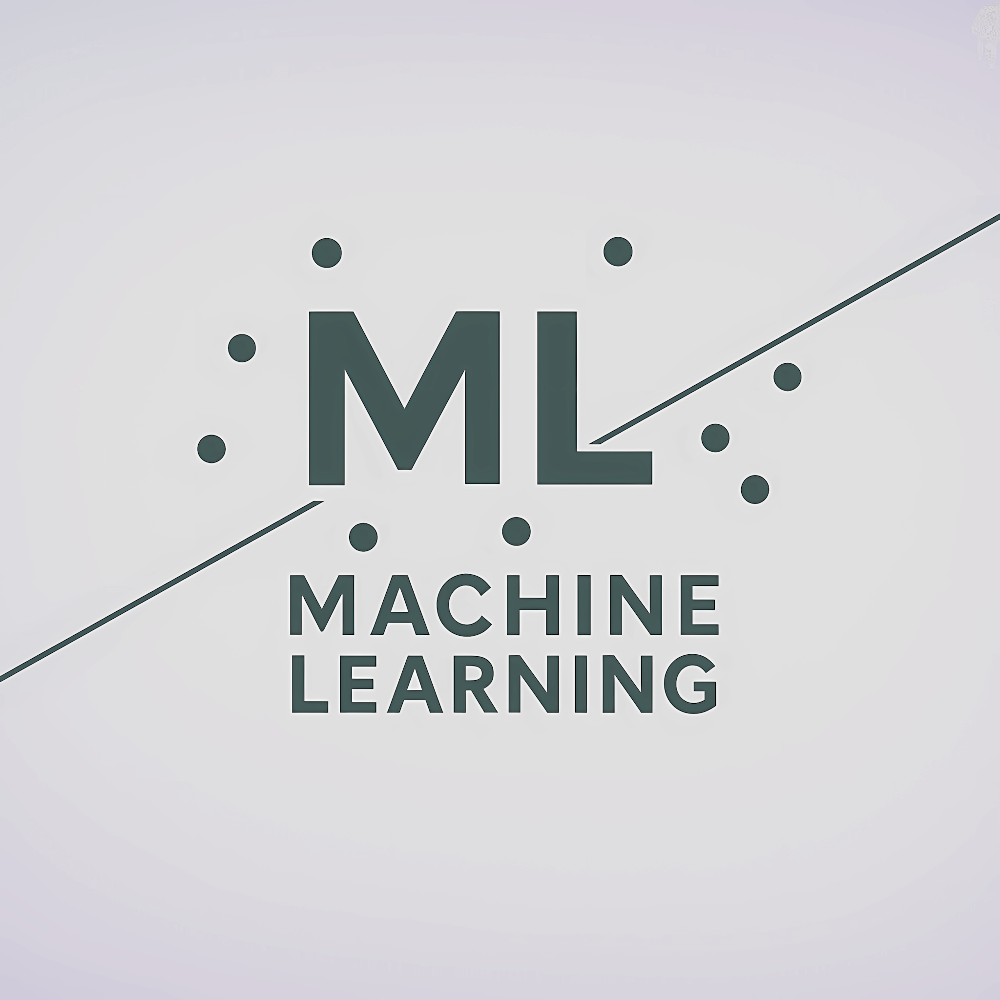
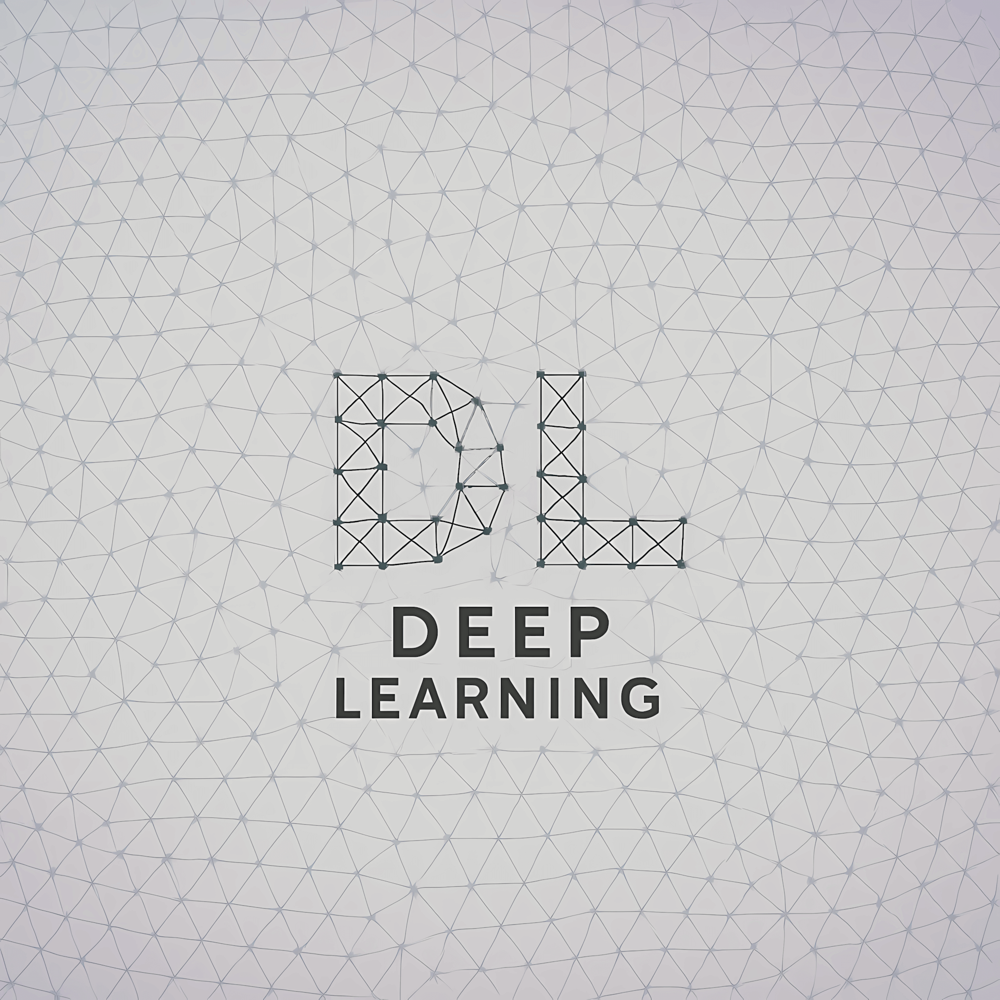

# Machine Learning from Scratch

<div style="text-align: center; margin-bottom: 20px;">
  
  
</div>

This repository contains implementations of various machine learning algorithms developed from scratch **using only Python and NumPy**. Each algorithm is implemented and organized according to its application domain (Computer Vision, Natural Language Processing, Time Series Forecasting, etc.). The code follows a clear structure, with each folder containing practical implementations and training routines for real-world problems.

Unlike standard implementations using existing libraries, **every module has been built entirely from scratch using only Python and NumPy**. This includes the implementation of a custom **Deep Learning framework** that allows users to create and train custom DL models without relying on external libraries like TensorFlow or PyTorch. The challenge of manually implementing features such as training pipelines, automatic differentiation, optimization algorithms, activation functions, and backpropagation adds has been a great educational and fun experience.

---

## Table of Contents

- [Overview](#overview)
- [Installation](#installation)
- [Folder Structure](#folder-structure)
- [Algorithms](#algorithms)
  - [Deep Learning](#deep-learning)
  - [Machine Learning](#traditional-machine-learning)
- [Usage](#usage)

---

## Overview

This repository serves as a comprehensive collection of foundational machine learning algorithms, with each algorithm implemented from scratch. Each one is accompanied by its training pipeline, allowing users to test the algorithms on sample data.

## Installation

1. Clone this repository:

   ```bash
   git clone https://github.com/FrancescoMontanaro/Machine-Learning-from-scratch
   cd Machine-Learning-from-scratch
   ```

2. Install dependencies:

   ```bash
   pip install -r requirements.txt
   ```

## Folder Structure

The project structure is organized by application domains and problem types, as shown below:

```plaintext
├── Deep Learning
│   ├── Computer Vision
│   │   ├── Image Classification
│   ├── Generative AI
│   │   ├── Autoencoders
│   │   ├── Natural Language Processing
│   ├── Regression
│   └── Time Series Forecasting
├── Machine Learning
│   ├── Reinforcement Learning
│   │   ├── Multi-Armed Bandit
│   ├── Supervised Learning
│   │   ├── Classification
│   │   ├── General Algorithms
│   │   ├── Regression
│   ├── Unsupervised Learning
│   │   ├── Clustering
│   │   └── Dimensionality Reduction
├── README.md
└── requirements.txt
```

## Algorithms

### Deep Learning

A comprehensive, fully-customizable **Deep Learning framework developed entirely from scratch using only NumPy** as an external dependency. It provides a robust foundation for building, training, and evaluating neural networks, featuring a modular design that emphasizes flexibility.

Framework location: [**Deep Learning Framework**](Deep%20Learning/src/)

Key features included:

- **Tensor-Based Computational Graph** with Automatic Differentiation:
  - Forward and backward propagation mechanisms
  - Dynamic computation graphs enabling flexible network architectures

- **Rich Collection of Neural Network Layers**:
  - Fully-connected (Dense) layers
  - Convolutional layers with various configurations
  - Recurrent layers (RNN, LSTM, GRU)
  - Transformer layers with multi-head attention
  - Pooling layers (e.g., MaxPooling)
  - Normalization layers (Batch Normalization, Layer Normalization)
  - Dropout layers for regularization
  - Embedding layers for handling discrete inputs

- **Comprehensive Set of Activation Functions**:
  - ReLU, Sigmoid, Tanh, Softmax, and LogSoftmax

- **Flexible Architectures**:
  - Sequential models
  - Auto-regressive models
  - Transformer-based architectures with attention mechanisms
  - Custom tokenizers and data loaders

- **Customizable Training Components**:
  - Optimizers (e.g., SGD, Adam)
  - Loss functions (Mean Squared Error, Binary and Categorical Cross-Entropy, etc.)
  - Metrics for evaluation (Accuracy, Precision, Recall, F1 Score, etc.)
  - Callbacks for training control (Early stopping, etc.)

### Machine Learning

Classic machine learning algorithms implemented from scratch:

#### Reinforcement Learning

1. [**Multi-Armed Bandit**](Machine%20Learning/Reinforcement%20Learning/Multi%20Armed%20Bandit)
   - Implementations of algorithms for the Multi-Armed Bandit problem, such as:
      - **Upper Confidence Bound (UCB1)**
      - **Thompson Sampling**

#### Supervised Learning

1. [**K-Nearest Neighbours (KNN)**](Machine%20Learning/Supervised%20Learning/General%20Algorithms/K%20Nearest%20Neghbours)
2. [**Linear Regression**](Machine%20Learning/Supervised%20Learning/Regression/Linear%20Regression)
3. [**Logistic Regression**](Machine%20Learning/Supervised%20Learning/Classification/Logistic%20Regression)
4. [**Naive Bayes**](Machine%20Learning/Supervised%20Learning/Classification/Naive%20Bayes)
5. [**Perceptron**](Machine%20Learning/Supervised%20Learning/General%20Algorithms/Perceptron)
6. [**Random Forest**](Machine%20Learning/Supervised%20Learning/General%20Algorithms/Random%20Forest)
7. [**Support Vector Machine (SVM)**](Machine%20Learning/Supervised%20Learning/Classification/Support%20Vector%20Machine)

#### Unsupervised Learning

1. [**K-Means Clustering**](Machine%20Learning/Unsupervised%20Learning/Clustering/K%20Means%20Clusetring)
2. [**Principal Component Analysis (PCA)**](Machine%20Learning/Unsupervised%20Learning/Dimensionality%20Reduction/Principal%20Component%20Analysis)

## Usage

Each application domain contains practical implementations with Jupyter notebooks (`.ipynb`) that demonstrate real-world use cases. The notebooks include:

- **Data loading and preprocessing**
- **Model architecture definition**
- **Training pipelines with validation**
- **Evaluation metrics and visualization**
- **Inference and prediction examples**